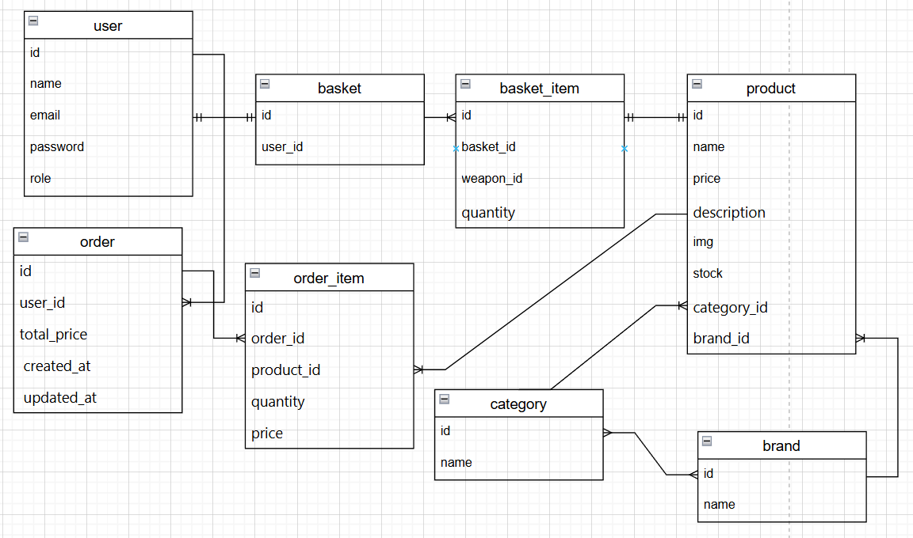

# Документація проєкту  
## Інформаційна система інтернет-магазину

# Мета проєкту

Метою проєкту є проєктування інформаційної системи інтернет-магазину, що забезпечує автоматизацію процесів електронної комерції, включаючи управління товарами, обробку замовлень та взаємодію з користувачами.

Система повинна забезпечити зручний доступ до каталогу товарів, можливість оформлення замовлень та ефективне управління магазином через адміністративний інтерфейс.
# Завдання проєкту

Для досягнення поставленої мети необхідно виконати наступні завдання:

- визначити предметну область інформаційної системи
- провести збір та аналіз вимог
- визначити користувачів системи та їх ролі
- сформулювати функціональні сценарії (User Stories)
- побудувати UML-діаграми взаємодії
- спроєктувати архітектуру системи
- створити модель даних
- обґрунтувати вибір бази даних
- проаналізувати можливості масштабування
- дослідити систему безпеки
- визначити перспективи розвитку системи
- обрати методологію розробки

# Короткий опис системи

Інформаційна система інтернет-магазину призначена для автоматизації процесів продажу товарів через мережу Інтернет.

Система дозволяє користувачам переглядати каталог товарів, додавати товари до кошика, оформлювати замовлення та переглядати історію покупок. Адміністратор системи має можливість керувати товарами, замовленнями та користувачами.

Архітектура системи побудована за трирівневою моделлю, що включає рівень представлення (frontend), рівень бізнес-логіки (backend) та рівень збереження даних (database).

# Розділи проєкту

# 1. Вибір предметної системи для проєктування

Для розробки було обрано інформаційну систему інтернет-магазину, призначену для автоматизації процесів електронної торгівлі.

Система забезпечує:

- представлення товарів у каталозі
- оформлення та обробку замовлень
- управління користувачами
- контроль продажів

Актуальність обраної системи обумовлена активним розвитком електронної комерції та необхідністю автоматизації бізнес-процесів у сфері онлайн-продажів.

# 2. Збір і аналіз вимог

У процесі аналізу предметної області було визначено основні бізнес-процеси інтернет-магазину:

- управління каталогом товарів
- оформлення та обробка замовлень
- оплата товарів
- управління користувачами
- обробка замовлень адміністрацією

Було сформовано функціональні вимоги до системи, серед яких:

- реєстрація та авторизація користувачів
- перегляд каталогу товарів
- пошук та фільтрація товарів
- управління кошиком
- оформлення замовлень

Також визначено нефункціональні вимоги, що стосуються продуктивності, безпеки, надійності та зручності використання системи.

# 3. Користувачі системи

У системі інтернет-магазину визначено три основні групи користувачів:

- **Гість** — неавторизований користувач, який може переглядати каталог товарів та інформацію про них.
- **Покупець** — зареєстрований користувач, який має можливість додавати товари до кошика, оформлювати замовлення та переглядати історію покупок.
- **Адміністратор** — користувач із розширеними правами доступу, який керує товарами, замовленнями та користувачами системи.

Розподіл ролей дозволяє забезпечити контроль доступу до функцій системи та організувати ефективну взаємодію користувачів із сервісом.

# 4. Функціональні сценарії (User Stories)

Функціональні можливості системи описано за допомогою користувацьких сценаріїв (User Stories), що відображають типові взаємодії користувачів із системою.

Для **гостей** передбачено сценарії перегляду каталогу, пошуку товарів та ознайомлення з інформацією про них.

Для **покупців** реалізовано сценарії додавання товарів до кошика, оформлення замовлення та перегляду історії покупок.

Для **адміністраторів** визначено сценарії управління каталогом товарів, редагування інформації про товари та обробки замовлень користувачів.

Такі сценарії дозволяють чітко визначити функціональні вимоги до системи та структуру взаємодії користувачів із сервісом.

# 5. UML-нотація користувацьких сценаріїв

Для моделювання взаємодії користувачів із системою було використано UML-діаграми послідовності.

Побудовано декілька основних діаграм:

- **Додавання товару до кошика** — описує процес вибору товару покупцем, перевірки його наявності в базі даних та додавання до кошика.

- **Оформлення замовлення** — демонструє послідовність дій під час створення замовлення та збереження його в базі даних.

- **Додавання товару адміністратором** — відображає процес створення нового товару та його збереження в системі.

Діаграми послідовності дозволяють наочно показати обмін повідомленнями між користувачем, веб-інтерфейсом, серверною частиною системи та базою даних.

# 6. Архітектура системи та залежності між підсистемами

Архітектура системи інтернет-магазину побудована за **трирівневою моделлю**, що складається з рівня представлення, рівня бізнес-логіки та рівня даних.

- **Presentation layer** забезпечує взаємодію користувачів із системою через веб-інтерфейс, включаючи перегляд каталогу, роботу з кошиком та оформлення замовлень.
- **Business logic layer** відповідає за обробку запитів, перевірку прав доступу, управління товарами, користувачами та замовленнями.
- **Data layer** забезпечує збереження та обробку даних у базі даних, включаючи інформацію про товари, користувачів і замовлення.

Система також може інтегруватися із зовнішніми сервісами, такими як платіжні системи, служби доставки та інструменти аналітики.

# 7. Модель даних

Модель даних системи відображає основні сутності інтернет-магазину та зв’язки між ними.

Ключовими сутностями є:

- **User** — користувачі системи (покупці та адміністратори)
- **Product** — товари каталогу
- **Category** та **Brand** — класифікація товарів
- **Basket** і **BasketItem** — структура кошика користувача
- **Order** і **OrderItem** — дані оформлених замовлень

Між сутностями встановлено зв’язки типу один-до-одного та один-до-багатьох, що дозволяє коректно моделювати процеси оформлення замовлень і управління каталогом товарів.

Модель даних представлено у вигляді ER-діаграми, що демонструє структуру таблиць та їх взаємозв’язки:

# 8. Обґрунтування вибору типу бази даних

Для реалізації системи обрано **реляційну модель бази даних (SQL)**, оскільки дані інтернет-магазину мають чітку структуру та взаємозв’язки між сутностями.

Використання SQL дозволяє ефективно працювати зі зв’язаними даними, виконувати складні запити та забезпечувати цілісність інформації.

Як основну систему управління базами даних обрано **PostgreSQL**, що забезпечує надійну підтримку транзакцій, індексування та масштабування.

Для підвищення продуктивності система може використовувати додаткові технології, зокрема кешування за допомогою Redis або реплікацію бази даних.

# 9. Аналіз можливостей масштабування системи

Система інтернет-магазину підтримує як **вертикальне**, так і **горизонтальне масштабування**.

Вертикальне масштабування передбачає збільшення ресурсів сервера, таких як процесор, оперативна пам’ять та швидкість дискової підсистеми.

Горизонтальне масштабування реалізується шляхом додавання декількох серверів застосунку та використання балансувальника навантаження для розподілу запитів користувачів.

Для підвищення надійності системи передбачено резервне копіювання бази даних, її реплікацію та використання кешування для зменшення навантаження на сервер.

У разі значного зростання системи можливий перехід до мікросервісної архітектури, що дозволить незалежно масштабувати окремі компоненти системи.

# 10. Аналіз системи безпеки

Безпека інформаційної системи забезпечується за допомогою механізмів автентифікації, авторизації та захисту даних.

Для автентифікації користувачів використовується перевірка логіна та пароля. Паролі зберігаються у базі даних у вигляді хешів, що забезпечує їх захист. Після входу в систему використовується механізм токенів або сесій для підтримки авторизованого стану користувача.

Авторизація реалізована за допомогою рольової моделі доступу (RBAC), що розмежовує права гостей, покупців та адміністраторів.

Для захисту чутливих даних застосовуються шифрування передавання даних через HTTPS, валідація вхідних даних та обмеження доступу до бази даних.

Надійність системи також підтримується регулярним резервним копіюванням бази даних та використанням механізмів контролю цілісності даних.

# 11. Перспективи розвитку системи

Інформаційна система інтернет-магазину має потенціал для подальшого розвитку та розширення функціональності.

Серед можливих напрямів розвитку можна виділити додавання системи відгуків та рейтингів товарів, реалізацію персоналізованих рекомендацій для користувачів, впровадження програм лояльності та інтеграцію онлайн-чату підтримки.

Також можливе розширення інтеграції з іншими інформаційними системами, зокрема CRM та ERP-системами, платіжними сервісами та аналітичними платформами.

З технічної точки зору система може бути розширена шляхом переходу до мікросервісної архітектури, використання контейнеризації та розгортання у хмарних середовищах.

Крім того, можливим напрямом розвитку є створення мобільних застосунків або прогресивного веб-застосунку (PWA) для зручнішого доступу користувачів до системи.

# 12. Методологія розробки системи

Для розробки інформаційної системи було обрано гнучку методологію **Agile**, зокрема підхід **Scrum**, що передбачає ітеративний процес створення програмного продукту.

Розробка здійснюється у вигляді коротких ітерацій (спринтів), під час яких поступово реалізується функціональність системи. Такий підхід дозволяє швидко отримувати результати роботи та вносити зміни відповідно до нових вимог.

Методологія Scrum добре підходить для даного проєкту, оскільки система має модульну структуру та може розроблятися поетапно: спочатку реалізується авторизація користувачів, потім каталог товарів, кошик, оформлення замовлень та адміністративна панель.

У процесі розробки можуть бути визначені ролі Product Owner, Scrum Master та команда розробників, які відповідають за планування, координацію та реалізацію функціональності системи.