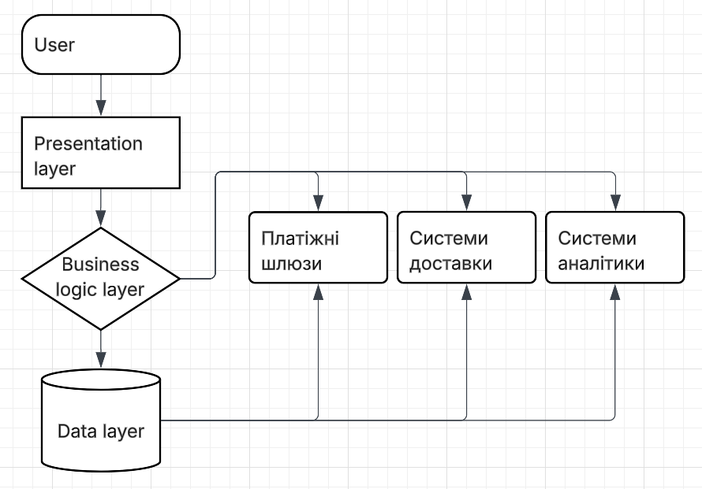

# Розділ 6. Архітектура системи та залежності між підсистемами

## 6.1 Логічна архітектура

Інформаційна система інтернет-магазину реалізована за **три-рівневою архітектурою**:

1. **Presentation layer (рівень представлення)**  
   - Веб-інтерфейс для користувачів (гість, покупець, адміністратор)  
   - Формування сторінок каталогу, кошика, оформлення замовлень  

2. **Business logic layer (рівень бізнес-логіки)**  
   - Обробка замовлень та кошика  
   - Перевірка доступу та авторизації  
   - Керування товарами та користувачами  

3. **Data layer (рівень даних)**  
   - Збереження інформації про товари, замовлення, користувачів  
   - Виконання запитів до бази даних  
   - Контроль цілісності даних  

---

## 6.2 Зовнішні системи та інтерфейси

- **Платіжні шлюзи** (наприклад, Stripe або LiqPay)  
  Інтерфейс: REST API для підтвердження платежів
- **Системи доставки** (нова пошта, Укрпошта)  
  Інтерфейс: REST API для отримання статусу доставки
- **Системи аналітики** (Google Analytics)  
  Інтерфейс: JavaScript SDK для збору статистики

---

## 6.3 Діаграма компонентів

**Пояснення:**  
- Кожен рівень архітектури відображено як окремий компонент  
- Стрілки показують залежності між Presentation, Business Logic і Data  
- Інтеграція з зовнішніми системами позначена окремо